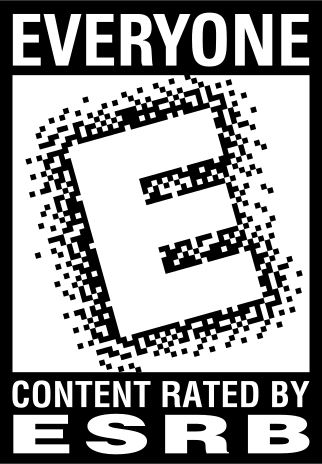
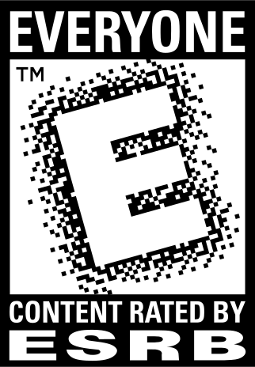
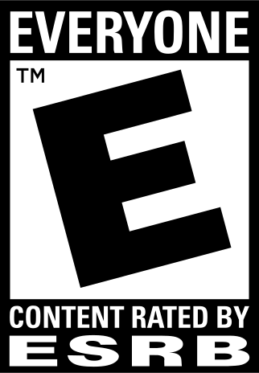
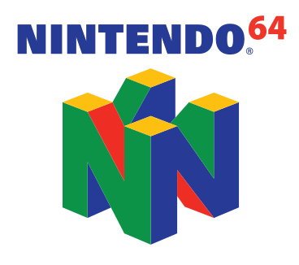
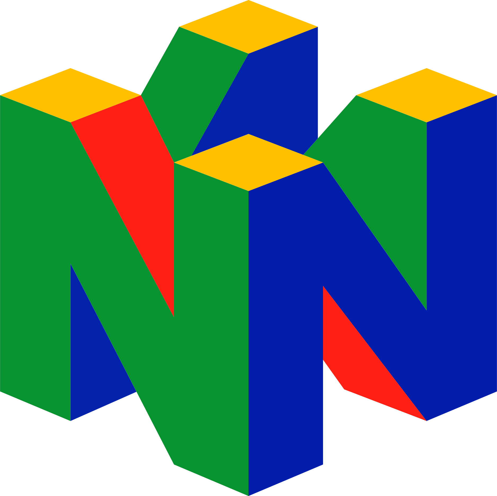
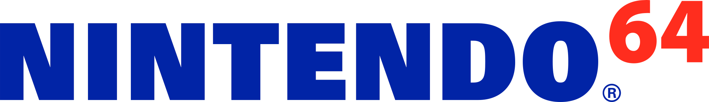
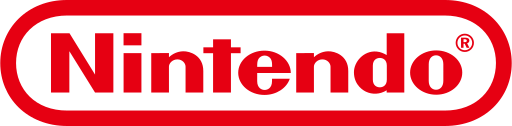
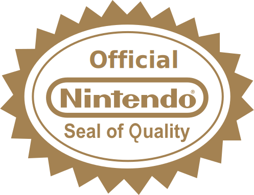
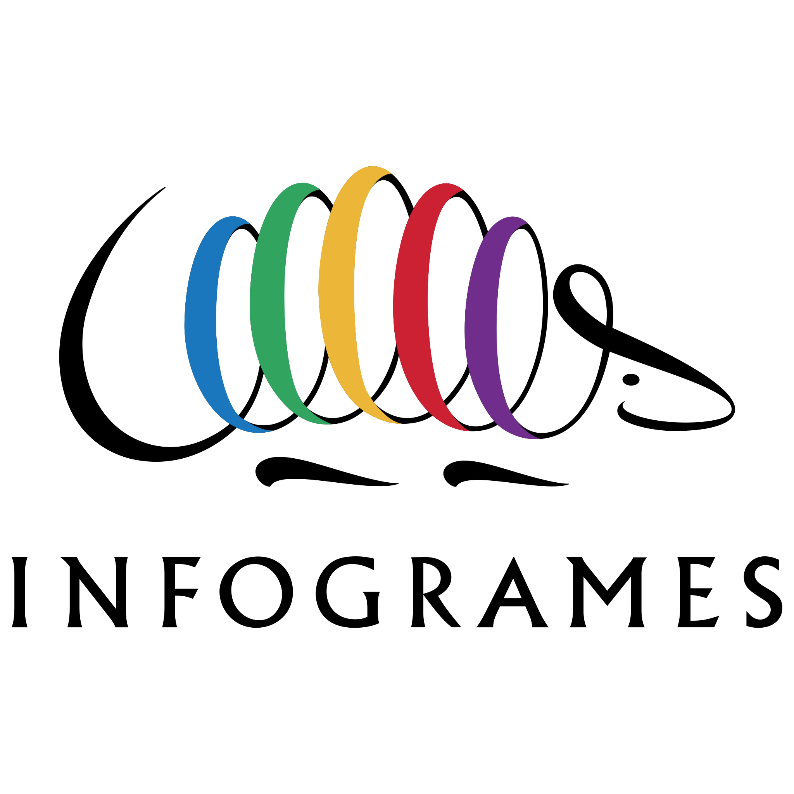

# N64 Assets Repository

Welcome to the N64 Assets Repository! This repository contains a collection of various vector and high-resolution image assets to be used for recreating and restoring Nintendo 64 cover artwork. These assets include:

- Nintendo logos
- N64 logos
- Quality seals
- ESRB ratings
- And more!

## Purpose

The purpose of this repository is to provide high-quality assets for enthusiasts and developers who are working on projects related to Nintendo 64 cover art restoration and recreation. These assets can be used in various applications, including emulators, custom cover designs, and more.

## N64 Color Palette

Below is the N64 color palette with hex codes:

| Color Name    | Hex Code  | Preview |
|---------------|-----------|---------|
| Violet Blue   | #384ea2   |  |
| Pigment Red   | #ee1c24   |  |
| Pigment Green | #00b35a   |  |
| Orange        | #faa51a   |  |

## Repository Contents

Here are some previews of the assets available in this repository:

### ESRB Ratings

| Image | Description | Format |
|-------|-------------|--------|
|  | ESRB E Rating (1998) | SVG |
|  | ESRB E Rating with Trademark (1998) | SVG |
|  | ESRB E Rating with Trademark (1999) | SVG |

### Nintendo Logos

| Image | Description | Format |
|-------|-------------|--------|
|  | N64 Cart Mark | SVG |
|  | N64 Logo | SVG |
|  | N64 Text Logo | SVG |
|  | Nintendo Logo | SVG |
|  | Quality Seal | SVG |
|  | Controller Box Icon | SVG |
|  | Rumble Box Icon | SVG |

### Publisher Logos

| Image | Description | Format |
|-------|-------------|--------|
|  | Infogrames Logo | SVG |
|  | Natsume Logo | SVG |
|  | Midway Games Logo | SVG |

## Related Repository

For a collection of Nintendo 64 label and cover art, please visit the following repository:

[N64 Covers Repository](https://github.com/IanSkelskey/n64-covers)

## Usage

Feel free to use these assets in your projects. If you do, please provide appropriate credit and link back to this repository.

## Contributing

Contributions are welcome! If you have any high-quality assets that you would like to add to this collection, please submit a pull request.

## License

This repository is licensed under the [MIT License](LICENSE). Please see the LICENSE file for more information.

## Contact

If you have any questions or suggestions, please open an issue or contact the repository owner.

Thank you for your interest in the N64 Assets Repository!
